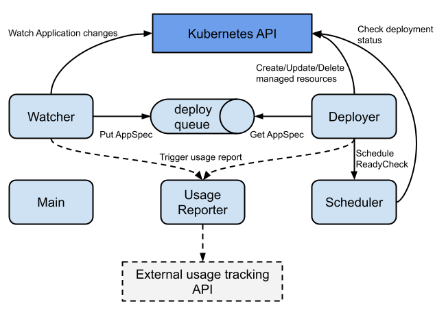

# fiaas-deploy-daemon overview

## Architecture

fiaas-deploy-daemon watches for changes on Application (CRD) resources, and manages Deployment, HorizontalPodAutoscaler, Service and Ingress resources based on the configuration in the Application resource. It also creates ApplicationStatus (CRD) resources which contain status of and information about application deployments.

fiaas-deploy-daemon has 5 worker threads:

- CRD watcher
  - Watches Kubernetes API for changes on Application resources. If a deployment needs to happen, it creates an `AppSpec` (internal representation of an application) and drops it on `deploy_queue` which is an in-memory queue.
- Deployer
  - Reads `AppSpec` from `deploy_queue`. Creates/updates/deletes Kubernetes resources generated from AppSpec to effectuate the deployment, schedules ready check on `Scheduler` to ensure deployment is successful.
- Scheduler
  - Keeps track of active ready checks for past deployments, and executes these at regular intervals until they succeed or time out.
- Main/webapp
  - The main thread runs a Flask webapp which has a few endpoints; transformation between fiaas.yml versions, metrics, health check endpoints.
- Usage reporter
  - If enabled, this makes a predefined HTTP call to a configurable endpoint each time a deployment is initiated/started/completed.

## Main sections of the codebase

- `fiaas_deploy_daemon/__init__.py`
This is where you find the main method and all the wiring to get the application up and running.

- `fiaas_deploy_daemon/bootstrap`
Contains code for running fiaas-deploy-daemon in bootstrap mode, with a separate main function. This is used for fiaas-deploy-daemon deploying itself.

- `fiaas_deploy_daemon/config.py`
Handling of configuration flags. This is where configuration at the fiaas-deploy-daemon instance level happens.

- `fiaas_deploy_daemon/crd`
Everything that has to do with running the CRD watcher and interacting with Application and ApplicationStatus resources.

- `fiaas_deploy_daemon/deployer`
The Deployer and Scheduler threads live here.

- `fiaas_deploy_daemon/deployer/kubernetes`
Contains all the transforms from AppSpec internal representation to Kubernetes resources

- `fiaas_deploy_daemon/lifecycle.py`
Implements a synchronous signaling mechanism which is used to trigger actions between different parts of the application as parts of the process of deploying an application. This is mainly used to keep ApplicationStatus updated when a deployment completes, and to trigger usage reporting.

- `fiaas_deploy_daemon/specs`
Transforms of fiaas.yml to the internal AppSpec representation. Supports multiple versions by transforming older versions (v2) to the latest version (v3).

- `fiaas_deploy_daemon/usage_reporting`
Trigger calls to a HTTP endpoint for different parts of the deployment lifecycle (start, success, failure).

- `fiaas_deploy_daemon/web`
Various HTTP endpoints.
